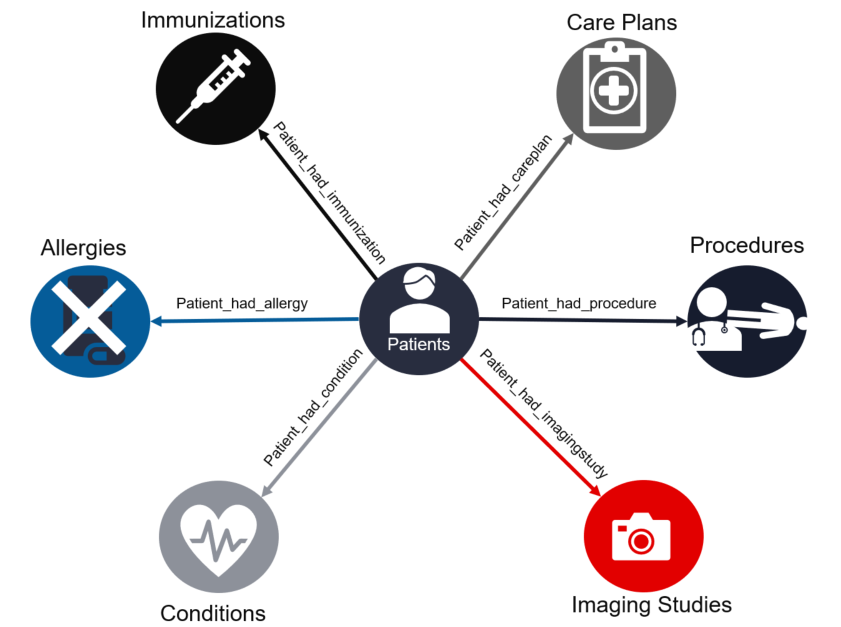
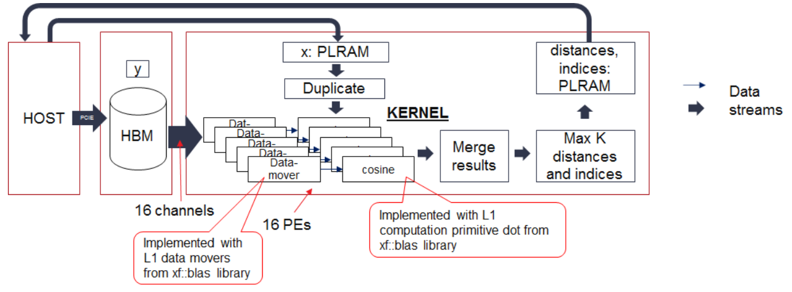

# High Level Architecture
## General use cases
### Synthea use case
Health and medical professionals are required to make predictions for diagnosis and prognosis in various medical problems. Individualized predictive analytics based on patient similarity is becoming popular in this field to identify similar patients to an index patient, derive insights from the records of the similar patients, and provide personalized predictions. Studies have shown that Consine similarity metrics can outperform conventional predictive modeling in which all available patient data are analyzed. The improved prediction performance is achieved at the cost of increased computational burden. 

Xilinx Graph Analytics library optimized for [Alveo Adaptable Accelerator Cards](https://www.xilinx.com/products/boards-and-kits/alveo.html) has been demonstrated on [SyntheaTM](https://synthetichealth.github.io/synthea/) generated patient data to greatly reduce that computational burden and provide predication results for patients more rapidly. SyntheaTM is an open-source, synthetic patient generator that models the medical history of synthetic patients and provides high-quality, synthetic, realistic but not real, patient data and associated health records covering every aspect of healthcare. 
 
### Product recommendation 
### Healthcare 
### Helpdesk
### Log file errors 
### Security

## Xilinx Vitis Graph Analytics Acceleration Library Plugin for TigerGraph
Xilinx Vitis Graph Analytics Acceleration Libray is seamlessly integrated with TigerGraph as a plugin. The low level hardware details are transparent to TigerGraph users.

The plugin consists of two major components as shown in the block diagram below:
* Xilinx Vitis Graph Analytics Library is provided as custom TigerGraph User Defined Function(UDF) that can be called directly from GSQL. 
* Xilinx Resource Manager (XRM) and Xilinx Run Time (XRT) libraries are installed on all processing nodes to manage resource allocation on Alveo Acceleration cards and data movement between the CPU and the FPGA.

## Cosine similarity
Cosine similarity is a measure of similarity between two non-zero vectors of an inner product space: 

In TigerGraph patients information and medical history are represented as vertexes and edges in a graph database as shown below:  

Each attribute (e.g. age, gender, race, immunization, etc) of a patient is mapped to a numerical value and becomes a feature of the patient vector. In our PoC design each paitent vector consists of 198 features and each feature is stored as a 32-bit integer. Consine similarity is calcualted between the index patient vector and all other patient vectors. The results are then sorted and the top 100 patients with highest scores are presented. Below is the detail of the feature map:

| Feature (INT)  | Descriptions       | 
| :------------- |:-------------------|
| 0              | Norm               |
| 1-2            | 64-bit patient VID |
| 3              | age                |
| 4              | gender             | 
| 5              | race               |
| 6              | ethnicity          | 
| 7-19           | reserved           |
| 20-39          | immunization map   | 
| 40-59          | allergy map        |
| 60-109         | conditions map     |
| 110-139        | imaging studies map|
| 140-189        | procedures map     | 
| 190-209        | careplans map      |

### Cosine similarity GSQL
TigerGraph uses GSQL query language for fast and scalable graph operations and analytics. A reference design of patient similarity based on cosine similarity was created in GSQL to baseline the functionalities and computation complexity of the algorithm. It is used to verify and validate the functioanl correctness and performance improvement of the Alveo accelerated desgin. Below is the block diagram of cosine similarity computation in GSQL, which is executed entirely on CPU.

### FPGA Accelerated cosine similarity function
Xilinx Vitis Graph Analytics Library plugin provides a user defined function that offloads the computation of cosine simimarity and the top K highest scores to the FPGA:

The accelerated cosine simlarity UDF consists of two parts:
* Host code: C++ code that runs on the CPU to manage resource allocation and data movement between the CPU and the FPGA
* Kernel: custom computation hardware logic that utilizes massive parallel processing horsepwer and abundant on-chip memory on FPGA. Each kernel contains two compute units(CUs) running in parallel with each CU connecting to one HBM stack that stores patients' records.

The kernel design for each CU is illustrated in the block diagram below. Each CU contains 16 fully pipelined cosine similarity processing elements (PEs) and one MaxK components to choose the top similarities. The 16 PEs are connected to 16 channels to access 5M patients' data in parallel. The incoming new patient's record is transmitted to the FPGA's PLRAM by the host and then duplicated to 16 PEs. The MaxK primitive calculates the top cosine similarities and their corresponding indices and writes them to the PLRAMA, which is read out by the host. In the end, the host will do a simple computation to extract the final top similarities from the two returned top similarity sets computed by the two CUs.

### Test drive cosine similarity acceleration on Alveo U50 on premise
The [Xilinx® Alveo™ U50 Data Center accelerator cards](https://www.xilinx.com/products/boards-and-kits/alveo/u50.html) 
provide optimized acceleration for workloads in financial computing, machine learning, computational storage, 
and data search and analytics. Built on Xilinx UltraScale+ architecture and packaged up in an efficient 
75-watt, small form factor, and armed with 100 Gbps networking I/O, PCIe Gen4, and HBM, Alveo U50 is 
designed for deployment in any server.  

Xilinx has demonstrated 400x acceleration of cosine simlarity running on Alveo U50 acceleration cards in 
an HPE DL385 server comparing to running on 128 CPU cores with 256GB RAM. A demo utilizing Xilinx TigerGraph 
plugin with Alveo U50 acceleration card is included in this repository to show the general usage of the plugin 
and the development flow of custom graph algorithm accelerators on Xilinx Alveo cards in TigerGraph. Please 
Check the user guide [Targeting Alveo in HPE Server](docs/TG_A_v1.md) for detailed instructions on how to 
run the demo.

## Test drive cosine similarity acceleration on Azure NP
NP Azure Virtual Machines for HPC coming soon – Our Alveo U250 FPGA-Accelerated VMs offer from 1-to-4 Xilinx U250 FPGA devices as an Azure VM- backed by powerful Xeon Platinum CPU cores, and fast NVMe-based storage. The NP series will enable true lift-and-shift and single-target development of FPGA applications for a general purpose cloud. Based on a board and software ecosystem customers can buy today, RTL and high-level language designs targeted at Xilinx’s U250 card and SDAccel 2019.1 runtime will run on Azure VMs just as they do on-premises and on the edge, enabling the bleeding edge of accelerator development to harness the power of the cloud without additional development costs.

# References
* Lee J, Maslove DM, Dubin JA. Personalized mortality prediction driven by electronic medical data and a patient similarity metric. PLoS One 2015 May;10(5):e0127428 [FREE Full text] [CrossRef] [Medline]
