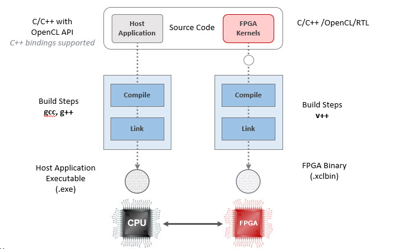
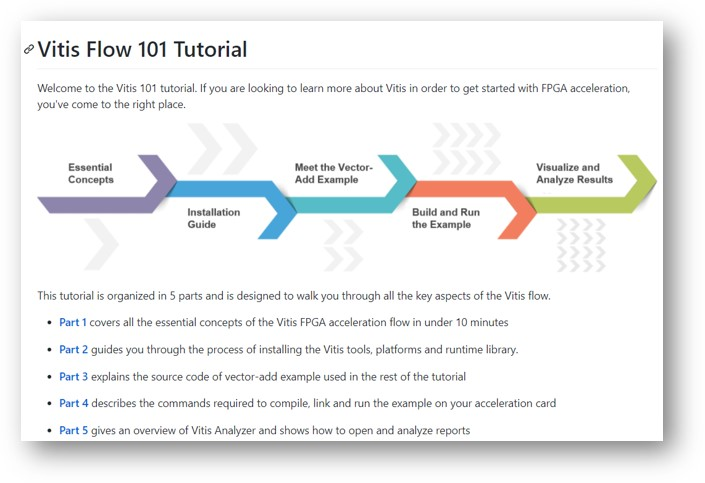
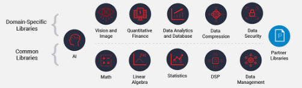

## Vitis Development Flow

As mentioned in the previous sections, there are two use cases - application end users and application developers. So far we have focused on the first use case - application end users who deploys applications. In this section we will cover the development flow for users who wants to create their own application to run on Alveo.

 

### Downloading Software
As far as required software goes, for deployment use you need to install: XRT, XRM and deployment shell, as you have done in the previous sections. For development use, you need to install Vitis software and development shell in addition to those. 
You can find all these from [here](https://www.xilinx.com/products/boards-and-kits/alveo/u50.html#gettingStarted).

### Programming Model
There are two parts in creating applications for Alveo. One involves programming the host application, which runs on x86 processor; and the second one is the FPGA application, which is the function we want to accelerate. The programming model is quite different between the two.  

Developing host applications is similar to any software development. You use C/C++ but the unique part is that you use OpenCL API, to perform all the tasks necessary to utilize functions running on FPGA, such as scheduling tasks to run in FPGA, moving data between host and FPGA, and programming FPGA, etc. You use gcc/g++ tools to develope and produce executables.  

Being able to program FPGA on the fly is also a big advantage.
As you complete certain tasks where you
no longer need them, you can swap the content of of the FPGA to a different
task;thus, economizing the FPGA resources by not having to store all the
tasks/compute units in the FPGA.  

Developing application for FPGA can be a daunting task. Design entry is
done typically using Verilog or VHDL -  commonly referred to as RTL (register transfer
language) which is rather low level description language. In Vitis design
environment, users can use C/C++/OpenCL C to describe and design functions,
which we refer to as kernels;then, High Level Synthesis (HLS or vitis_hls) tool transforms it to RTL. This is a game changer that enables software developer to create functions to run on FPGA without knowing any low level FPGA implementation.   

Once the kernel is in RTL, the rest of the process all the way to programming 
the FPGA is done autonomously in Vitis development environment. During this
process RTL code is synthesized - mapped to FPGA resources and wired properly, then
bitstream containing these programming information is created into a filed
called *xclbin*.

synthesis/implementation tool in Vitis environment to map/place/route and produces the bitstream that programs FPGA. This bitstream is contained in *xclbin* file. Once you create these blocks the rest of the FPGA implementation specific tasks are automatically carried out in Vitis environment. This is the key in enabling SW application developers to offload compute intensive tasks to FPGA without knowing/doing much of FPGA implementation.

One caveat to be aware is that FPGA implementation task can take a long time - multiple hours. So before you commit to FPGA implementation task, you want to make sure your design is functionally correct and make sure the performance estimate meets the performance requirements. CPU emulation, HW emulation and reports from HLS tools in Vitis environment can help you do that.
 

In many use cases, a user will have access to the kernel library and all
its *xclbin* is provided, then his interest might be just to develop SW application
utilizing those FPGA functions available in *xclbin* and does not have to deal with any FPGA
implementation tasks. In this case it becomes a pure SW application development flow, where user simply calls those functions thru API in his host codes.

### Optimizing for Performance
The basic concepts of parallel programming applies to programming Alveo to get
the optimum performance, such as:
- distribution of workload: how to best distribute the workload over the available processing elements (we
call them compute units - CU, or kernel), similar to ND partitioning in OpenCL paradigm.
Some algorithms works out better in this regard than others. For cosine
similarity computation, we can easily distribute the workload over the available
compute units.
- what hits the fan first: identifying what is the limiting factor as we try to
  increase the performance.  Is it data bandwidth or computation resources?
- data movement: how does the data flow among PCIe, DDR/FPGA, network interface, FPGA to FPGA (in multiple FPGA case) and where is the bottleneck?
- kernel optimization: Once we figure out how data gets to the kernel, we need
  the best kernel performance possible. This is where HLS tools (vitis_hls) comes in. You can "guide" HLS by applying/embedding pragmas in the source codes (C, C++ or OpenCL C). You can iterate - apply pragmas, synthesize, check out the performance, where each iteration can be done fairly quickly, until you reach the performance goal.

### Still Interested?

There are several resources to help you get started with creating your own accelerator functions.

- [Vitis Tutorial](https://github.com/Xilinx/Vitis-Tutorials)  
This covers overview/introduction of Vitis development flow, build/run designs
and analyze results.

- [Examples](https://github.com/Xilinx/Vitis_Accel_Examples) 
Some times you just want to see an example that works rather than reading thru one
document after another. Using such an example, you can understand the concept and use
that to start your own design. You will see many bite-sized examples on
optimization techniques for HLS and Vitis here.

- [Vitis Library](https://github.com/Xilinx/Vitis_Libraries) 
You have seen this already. This has several domain specific libraries of
functions that you can use to compile/build your own applications

