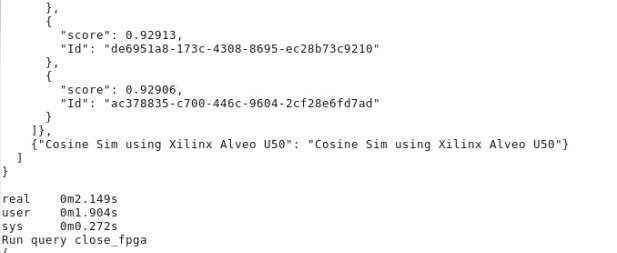

# Install steps

## Install XRT/XRM/U50 shells

1. Plug in U50
1. Install [TigerGraph Enterprise version 3.1](https://info.tigergraph.com/enterprise-free) with all the default settings like user name, passwords, directories.
1. Git clone [graph analytic library](https://gitenterprise.xilinx.com/FaaSApps/graphanalytics). Use this the internal version before we push it out the public Github. 
1. Get the installation package from [here](https://xilinx-my.sharepoint.com/:u:/r/personal/ywu_xilinx_com/Documents/xilinx-public/xilinx-tigergraph-install.tar.gz?csf=1&web=1&e=s3548L). (This will eventually put into the Xilinx lounge). This has XRT/XRM install files with static boost library, U50 deployment shell, and xclbin file used for this PoC.
1. Put the installation package to \<graph analytic directory>\/scripts
1. cd scripts
1. tar xzf xilinx-tigergraph-install.tar.gz
1. Make sure you have "jq" installed. If not "sudo apt install jq". You need
   this for install.sh
1. ./install.sh
1. flash the card and cold-reboot
1. Now you should have XRT/XRM/U50 shell installed and xclbin copied to
   TigerGraph install directory

## Porting cosine similarity IP to TigerGraph framework

1. cd \<graph analytic directory>\/plugin
1. make sure plugin directory is owned by tigergraph - "sudo chown -R tigergraph
   plugin"
1. su - tigergraph
1. open install.sh and swap "gadmin start" with "gadmin start all"
1. ./install.sh 
1. cd \<graph analytic directory>\/plugin/tigergraph/tests/cosine_nbor_ss_dense_int
1. ./run.sh

