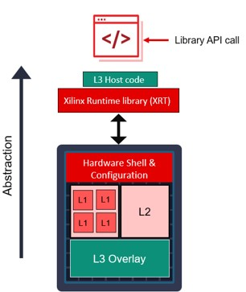

## Targeting Alveo in HPE server

Alveo U50 is a PCIe card with a FPGA that accelerates compute intensive applications like graphics analytics. This has 16 channels of DDR like memory called High Bandwidth Memory (HBM) that offers +200GB/s memory bandwidth; and close to 6K Multiply-Accumulate like engines to speed up the computation. 
Other components of the FPGA are: SRAM blocks and look-up table elements that can used to build custom
computation engines.

The server where Alveo U50 card is plugged in is HPE DL385 with 2x AMD EPYC
processor. This is where we will install TigerGraph software and Xilinx Vitis
tool environment in order to deploy cosine similarity application. 

The OS used in this deployment is Ubuntu 16.04. It is strongly recommended that users stick with this OS since that is the version we tested here. CentOS is not recommended


<p align="center">

</p>


### Vitis Tool

Vitis is a unified software environment that comprises of:

- Tools to deploy and run applications on Alveo cards, which includes XRT (Xilinx Runtime), and XRM (Xilinx Resouce Manager)

- Tools to develop custom applications: High Level Synthesis tool - which "maps" C/C++/OpenCL C to FPGA, Vivado FPGA implementation and simulation/debugging/profiling environment. This would be covered in the last section - [Vitis development flow](./vitis_dev_flow.md)

- Libraries, like graph analytics library

<p align="center">

</p>

In order to deploy and run an application like Cosine Similarity on Alveo cards, you need to install the following in order:

1) U50 card to a server 
2) Xilinx Runtime (XRT)
3) Xilinx Resource Manager (XRM)
4) Alveo Deployment shell
5) Install TigerGraph Enterprise version 3.1 
6) Vitis Library

<p align="center">

</p>


### 1. Alveo U50 Install

Check out the following for details on the Alveo U50 installation:
- [Landing page for U50](https://www.xilinx.com/products/boards-and-kits/alveo/u50.html#overview)
- [UG1301](https://www.xilinx.com/support/documentation/boards_and_kits/accelerator-cards/2019_1/ug1301-getting-started-guide-alveo-accelerator-cards.pdf) 


### 2. XRT (Xilinx Runtime)

XRT is a key component in running application in Alveo. It handles all the data movement between host (x86) and FPGA, board management, FPGA programming and orchestrating tasks running on FPGA


<p align="center">

</p>


### Building/Installing XRT

Typically XRT can be installed simply from .deb/.rpm package, but TigerGraph integration requires you to have a static version of boost library, so you must build XRT from sources with a static boost library before you do the installtion. These are the steps in Ubuntu OS:

1) Build XRT
```
git clone -b master https://github.com/Xilinx/XRT 
sudo -i
cd <XRT install directory>
PATH_XRT=$PWD
source $PATH_XRT/src/runtime_src/tools/scripts/xrtdeps.sh
source $PATH_XRT/src/runtime_src/tools/scripts/boost.sh -prefix $PATH_XRT/boost
source $PATH_XRT/build/build.sh -clean
sudo -i
cd <XRT install directory>
PATH_XRT=$PWD
env XRT_BOOST_INSTALL=$PATH_XRT/boost/xrt $PATH_XRT/build/build.sh
cd $PATH_XRT/build/Release
make package
```

2) Install XRT
```
cd $PATH_XRT/build/Release
apt install ./xrt_202110.2.9.0_16.04-amd64-xrt.deb
```


### 3. XRM (Xilinx Resource Manager)

XRM is the software to manage all the FPGA resources on the system. 
- All the kernels on FPGA board are abstracted as compute unit (CU) resources. 
- XRM provides interfaces to allocate and release CU. 
- XRM provides command line tool (*xrmadm*) to download xclbin to FPGA devices and builds the resource database.
- XRM daemon (*xrmd*) is running on the background process to support resource reservation, relinquishing, allocation and release of CU. 
- Load distribution among CUs can be easily done utilizing XRM APIs
- Check [overview of XRM](https://developer.xilinx.com/en/articles/orchestrating-alveo-compute-workloads-with-xrm.html) and [*xrm.h*](https://github.com/Xilinx/XRM/blob/master/src/lib/xrm.h) for
  more details


<p align="center">

</p>


### Building/Installing XRM
Similar to XRT, we need to build XRM with a static boost library for stability.

```
# use this Github for now. It will be replaced with https://github.com/Xilinx/XRM later
git clone -b master https://gitenterprise.xilinx.com/ywu/XRM
sudo -i
cd <install dir>
./boost.sh
./build.sh -clean
env XRM_BOOST_INSTALL=$install ./build.sh
cd <install dir>/Release
apt install ./xrm_202020.1.1.0_16.04-x86_64.deb

```

### 4. Alveo deployment shell

There are two major partitions or areas within the FPGA - one is a static area we call "shell" and the other is a region where we program our custom application. The shell partition is programmed by the deployment shell which we need to install. This shell functions as a hardware infrastructure where data movement between host and FPGA/global memory and configuration/control of custom logic region are handled.  *xclbin* is a binary file that contains the information which programs this custom logic region. 


<p align="center">

</p>


### Installing deployment shell

Here are the steps to install a deployment shell for U50. First, download the deployment shell (version 2020.1, Ubuntu 16.04) from [here](https://www.xilinx.com/products/boards-and-kits/alveo/u50.html#gettingStarted)
```
tar xvzf <xilinx_....>.deb.tar.gz
sudo apt install all 3 files 
# follow the instruction on the log message to flash the card, and cold-reboot
```

Test to XRT/deployment shell are properly installed and U50 is working
```
source /opt/xilinx/xrt/setup.sh
xbutil query # for simple query to see if U50 is visible
xbutil validate # for more thorough testing of the board
```

### 5. TigerGrpah software

We need to install TigerGraph Enterprise version 3.1. Make sure you download this particular version to ensure the rest of the install works properly. You can start from [here](https://info.tigergraph.com/enterprise-free), where you need to sign up in order to access the SW download.


### 6. Vitis Library

[Vitis Library](https://xilinx.github.io/Vitis_Libraries/index.html) includes several domain specific libraries which are open-sourced (Apache License, v2.0) and performance optimized. You will be using only [Graph Library](https://gitenterprise.xilinx.com/FaaSApps/graphanalytics) part of Vitis Library in this exercise.

<p align="center">

</p>

Follow the steps below to install Graph Library. All the files in this library must be owned by tigergraph user, which is necessary during "plugin" process later. If you already have Vitis Graph Library installed, you can use "chown" command to change the ownership to TigerGraph user. 

Notice that this Github is a slightly modified version from the Graph Library in
Vitis Library.

```
su - tigergraph 
git clone -b master https://gitenterprise.xilinx.com/FaaSApps/graphanalytics
```

It would be helpful to understand the basic structure of Vitis Library. There are 3 levels of hierarchy in Vitis Library. 
- Level 1 (L1): this is the lowest level. It is primitive functions which are called by L2/L3 functions
- Level 2 (L2): this is a kernel level function, meaning that it has the proper interface (AXI-M/AXI-lite interface) and HLS pragmas embedded in the code to guide HLS synthesis. These are the kind of functions you can call from the host code and runs on the board. Most of L2 functions comes with a host code and a kernel code
- Level 3 (L3): highest level functions, which instantiates L2/L1 functions. You can view this as a standalone application, like many of graph analytic functions.


<p align="center">

</p>

## Next Step
Now we have installed everything necessary for TigerGraph integration, we can
start the porting process - see [Integration with TigerGraph](./integrate_TG.md) section. <br />


# License

Licensed using the [Apache 2.0 license](https://www.apache.org/licenses/LICENSE-2.0).

    Copyright 2020-2021 Xilinx, Inc.
    
    Licensed under the Apache License, Version 2.0 (the "License");
    you may not use this file except in compliance with the License.
    You may obtain a copy of the License at
    
        http://www.apache.org/licenses/LICENSE-2.0
    
    Unless required by applicable law or agreed to in writing, software
    distributed under the License is distributed on an "AS IS" BASIS,
    WITHOUT WARRANTIES OR CONDITIONS OF ANY KIND, either express or implied.
    See the License for the specific language governing permissions and
    limitations under the License.
    Copyright 2020-2021 Xilinx, Inc.
